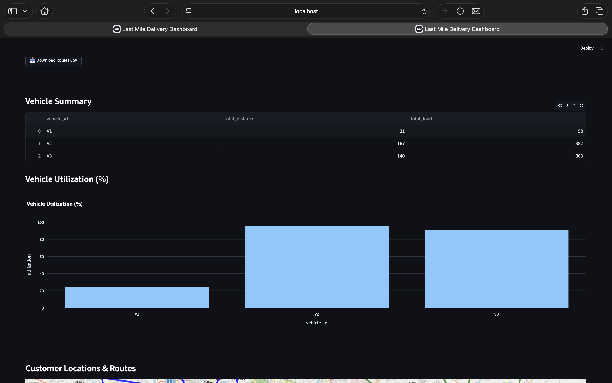
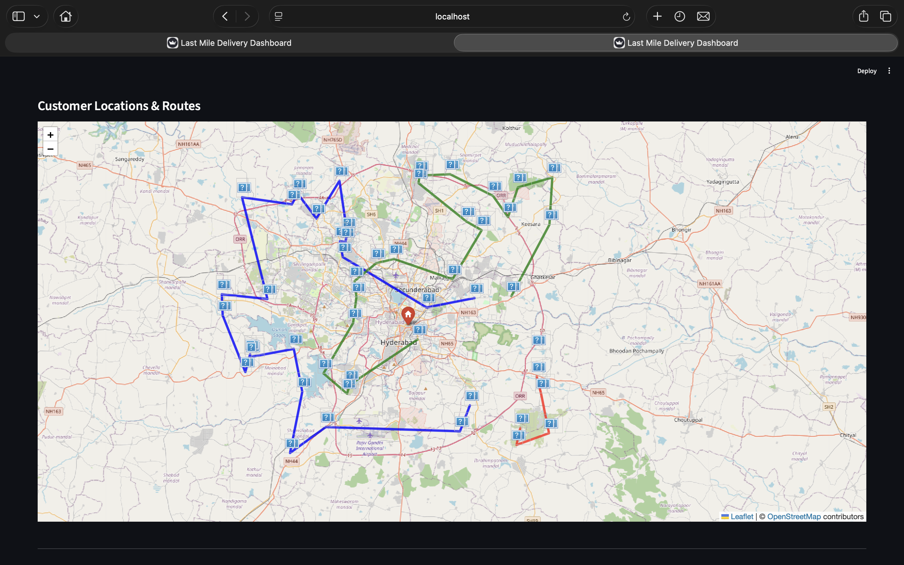
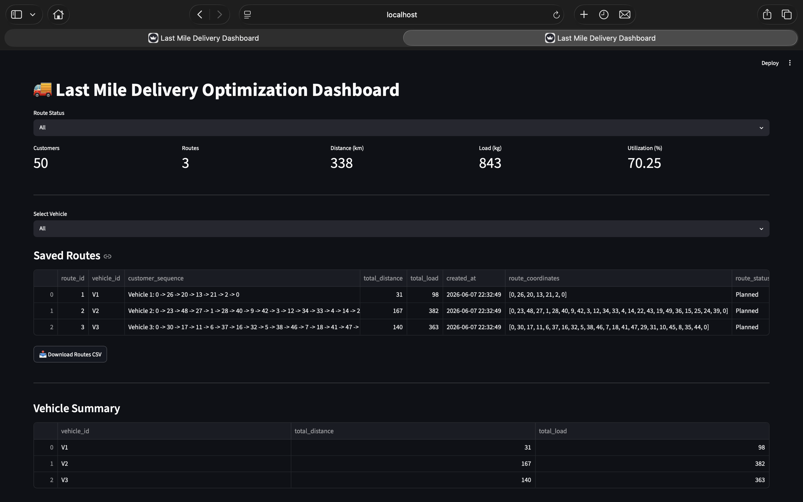
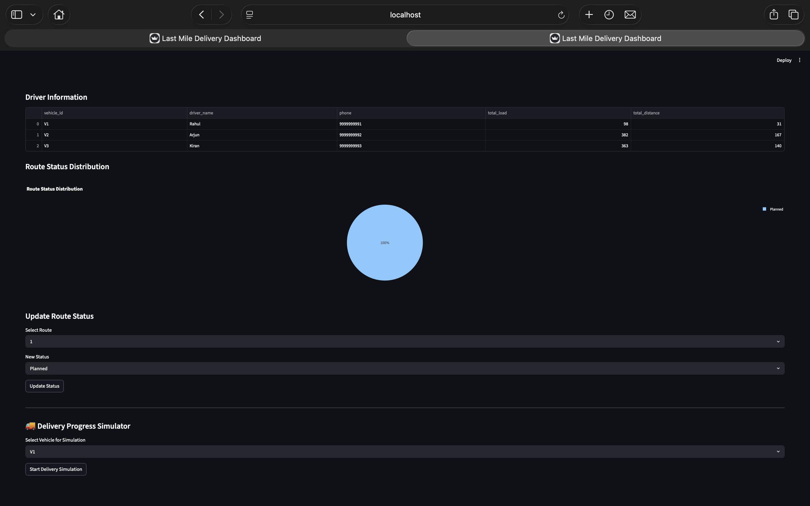

# Last Mile Delivery Optimization

## Overview
A logistics optimization system that minimizes delivery distance and improves vehicle utilization using Google OR-Tools.

## Features
- Vehicle Route Optimization (VRP)
- PostgreSQL Database Integration
- Customer Demand Management
- Route Visualization using Folium
- Streamlit Dashboard
- Route Status Tracking
- Delivery Progress Simulation

## Tech Stack
- Python
- PostgreSQL
- Streamlit
- OR-Tools
- Pandas
- Folium
- Plotly

## Project Architecture
ETL → Optimization Engine → PostgreSQL → Dashboard

## Results
- Optimized 50 customer deliveries
- Reduced total travel distance
- Improved vehicle utilization

## Screenshots

### Dashboard

### Route Optimization

### Analytics

### Delivery Simulator

## Run Locally
pip install -r requirements.txt
python -m etl.load_orders
python -m optimization.vrptw_solver
streamlit run dashboard/app.py
